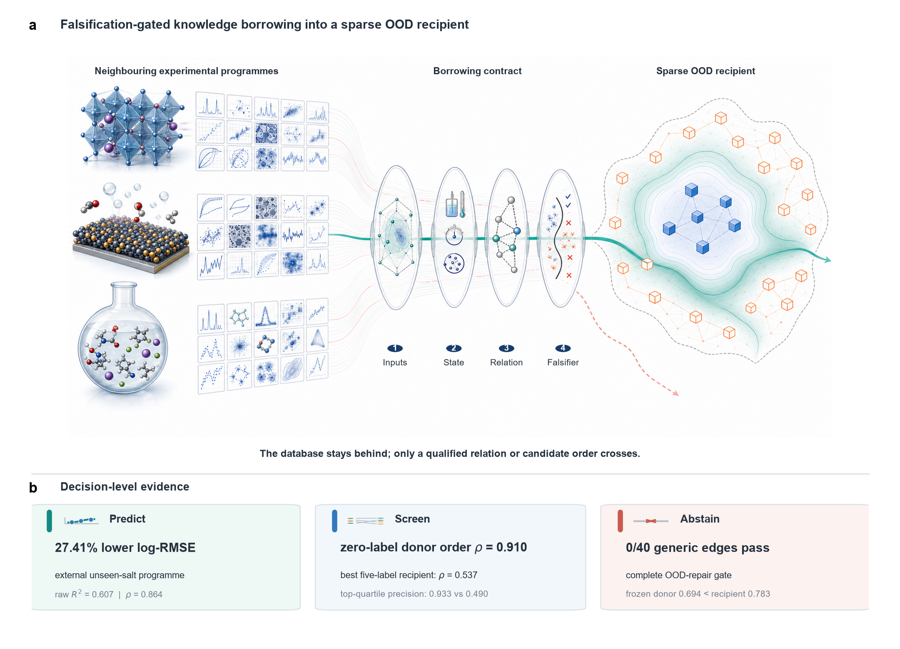

# Collective Experimental Data Index

**Experimental-data infrastructure and a falsification-gated method for borrowing knowledge across neighbouring scientific programmes.**

[](CATALOG.md)
[](research/data/ANALYSED_RESOURCE_LEDGER.csv)
[](research/evidence/ATTEMPT_LEDGER.csv)
[](analysis/MANUSCRIPT_DRAFT_STREAMLINED.md)



## The project in one sentence

Neighbouring experimental programmes can improve selected out-of-distribution
(OOD) predictions and candidate rankings when the shared relation,
experimental state, transferable object, leakage boundary, and decision
endpoint are matched; otherwise the method should abstain.

## Why this project exists

Scientific exploration is most valuable outside the region that has already
been measured, but this is also where a data-poor model has the weakest
empirical support. Experimental databases from nearby fields may contain
useful information about common compositions, transport processes, structural
motifs, processing histories, or measurement conditions. Simply pooling these
databases, however, can import provenance effects, fitted-parameter artefacts,
or negative transfer instead of knowledge.

This repository addresses both sides of that problem. It provides a curated
index of experimental materials and chemistry databases, and it tests a
directed **knowledge-borrowing contract**. Rather than moving an entire donor
database or a generic pretrained model into a sparse recipient task, the
contract transfers a qualified relation or candidate ordering, tests it
against matched falsifiers, and routes it to numerical prediction, candidate
screening, or rejection.

## What the study shows

The paper is built around four claim-bearing results:

1. **Generic transfer is not enough.** Cross-fitted donor predictions repaired
   0 of 40 declared OOD edges across eight recipients under the complete
   prediction gate.
2. **A qualified relation can cross database and chemistry identity.** A
   component-order-invariant electrolyte relation learned from 10,407
   measurements across 22 salts predicted an external unseen-salt programme
   with raw R² = 0.607, Spearman ρ = 0.864, and 27.41% lower log-RMSE than a
   temperature–concentration baseline.
3. **Borrowed order can improve data-poor screening even when absolute
   calibration is not portable.** A zero-label, programme-balanced ordinal
   score ranked unseen formulations at ρ = 0.910, compared with 0.537 for the
   strongest of 13 recipient-only configurations trained on five measured
   formulations. The gain was Δρ = 0.374, with a 95% interval of 0.213–0.562
   over anchor selections within this recipient.
4. **Failure and abstention are part of the map.** The same frozen ordinal
   route did not beat a same-anchor recipient model in a second programme, and
   controlled catalyst perturbations separated predictive, ranking-only, and
   harmful edges.

These are retrospective experimental-data tests. They support selective OOD
prediction and screening, not a universal transfer model, a unified physical
law, or prospective laboratory discovery acceleration.

## How knowledge borrowing works

| Stage | Question | Required evidence | Possible outcome |
|---|---|---|---|
| **1. Qualify** | Are the donor and recipient neighbours for this task? | Shared candidate representation, relevant experimental state, and a falsifiable physical or experimental relation | Eligible or reject |
| **2. Transfer** | What exactly crosses the boundary? | A relation, response function, correction, or ordinal score; not automatically the raw database or model weights | Declared transferable object |
| **3. Falsify** | Is the signal more than leakage, weak baselines, or generic regularization? | Grouped OOD splits, identity and provenance exclusions, strong recipient-only baselines, shuffled donors, and matched wrong donors | Supported, null, or harmful |
| **4. Route** | What decision can the signal support? | Endpoint-specific utility and absolute-performance gates | Predict, rank, or abstain |

The method is directional: a resource may be a donor for one endpoint, a
recipient for another, and ineligible for a third. “Neighbouring” is therefore
a property of a declared donor–recipient relation, not a permanent label
attached to a database.

## Data scope: three layers that should not be confused

| Layer | Current scope | What it means |
|---|---:|---|
| **Discovery catalog** | 127 resources | Resources with experimental content discovered and curated for access, domain, licence, and provenance. Catalog presence does not mean that a resource entered the paper. |
| **Analysed-resource ledger** | 31 resources | Databases used, screened, or formally audited during the project, including unsuccessful candidates and controls. |
| **Paper evidence layer** | Selected claim-bearing experiments | The small set of positive, boundary, and falsification results needed to support the manuscript's argument. |

The catalog currently contains 98 experimental and 29 mixed
experimental/computational resources: 118 are open, 5 require registration,
and 4 are restricted. Twenty-two records still have an unresolved data
licence. The local integrated snapshot registers 14 sources (13 normalized and
one analysis-only) and contains 96,184 measurements, 230 property labels, and
29,516 canonical formula, molecule, or mixture entities.

- Browse the catalog: [CATALOG.md](CATALOG.md) or
  [catalog/catalog.csv](catalog/catalog.csv)
- See what the project actually used: [analysed-resource
  ledger](research/data/ANALYSED_RESOURCE_LEDGER.csv)
- See every retained transfer attempt: [attempt
  ledger](research/evidence/ATTEMPT_LEDGER.csv)

## Start here

| If you want to... | Read this first |
|---|---|
| Understand the scientific story | [Latest manuscript](analysis/MANUSCRIPT_DRAFT_STREAMLINED.md) |
| See the evidence hierarchy and safe claims | [Paper package](analysis/PAPER_PACKAGE.md) |
| Check methods, robustness, nulls, and amendments | [Supplementary Information](analysis/SUPPLEMENTARY_INFORMATION.md) |
| Inspect all positive, null, harmful, abstaining, and non-evaluable attempts | [Attempt ledger](research/evidence/ATTEMPT_LEDGER.csv) |
| Identify data access, DOI, licence, and redistribution status | [Analysed-resource ledger](research/data/ANALYSED_RESOURCE_LEDGER.csv) |
| Browse every broad and task-specific database connected to the project | [Database guide](research/data/DATABASE_GUIDE.md) |
| Review the four manuscript figures and their source data | [Figure directory](analysis/figures/) and [figure QA](analysis/figures/FIGURE_QA_NMI_V3.md) |
| Reproduce or extend an analysis | [Analysis guide](analysis/README.md) |
| Run the frozen high-performance-computing workflows | [Balam guide](analysis/balam/README.md) |
| Review Edison, Hypothesis Generation, and Legacy Kosmos outputs | [Edison report index](analysis/review_packages/edison/README.md) |
| See exactly what is included in this release | [Release manifest](research/RELEASE_MANIFEST.md) |

## Repository structure

```text
.
├── catalog/                  machine-readable experimental-resource index
├── scripts/localdb/          pinned ingestion and unified SQLite builder
├── analysis/
│   ├── MANUSCRIPT_*.md       manuscript drafts and paper package
│   ├── figures/              main and supplementary figures plus source data
│   ├── results/              compact formal outputs and verification records
│   ├── review_packages/      Edison, Claude, and independent audit materials
│   └── balam/                frozen remote-run, fetch, and verification helpers
├── research/
│   ├── data/                 analysed-resource ledger and data policy
│   ├── evidence/             complete transfer-attempt ledger
│   └── manuscript/           canonical manuscript navigation
├── tests/                    integrity and scientific-workflow tests
├── CATALOG.md                human-readable catalog
└── CITATION.cff              repository citation metadata
```

## Reproduce the release checks

Python 3.11 or newer is recommended. From the repository root:

```bash
python -m venv .venv
# PowerShell: .\.venv\Scripts\Activate.ps1
# POSIX:      source .venv/bin/activate
python -m pip install -r scripts/requirements.txt -r analysis/requirements.txt

python scripts/validate_catalog.py
python scripts/validate_candidates.py
python -m unittest discover -s tests -v
python analysis/check_core_story_experiments.py
python analysis/verify_main_figures_nmi_v3.py
```

To rebuild the pinned local snapshot:

```bash
python scripts/localdb/build_localdb.py
python analysis/audit_snapshot.py
```

Some analyses require external upstream data, substantial CPU time, or the
frozen Balam packages. Follow [analysis/README.md](analysis/README.md) for the
analysis-specific commands instead of treating one monolithic command list as
a complete reproduction.

## How collaborators should add evidence

1. **Declare the scientific relation first.** Name the donor, recipient,
   candidate representation, experimental state, transferable object, OOD
   unit, and decision endpoint.
2. **Freeze the evaluation before reading the target outcome.** Record splits,
   baselines, falsifiers, metrics, thresholds, seeds, and leakage exclusions in
   a protocol or design file.
3. **Keep recipient-only baselines competitive.** A donor should not receive
   credit merely because the target model was weak.
4. **Verify independently.** Retain compact summaries, checksums, and a script
   that reconstructs the claim-bearing metrics.
5. **Record every result.** Positive, null, harmful, abstaining, and
   non-evaluable attempts all belong in
   [ATTEMPT_LEDGER.csv](research/evidence/ATTEMPT_LEDGER.csv).
6. **Update claims only after the gate is passed.** Exploratory diagnostics and
   AI-generated hypotheses cannot overwrite a frozen primary result.

## External AI research reports

Edison Literature High, Edison clean-sheet research, Hypothesis Generation,
and Legacy Kosmos reports are preserved with their prompts, task identifiers,
source links, local audits, and validation outputs in
[analysis/review_packages/edison/](analysis/review_packages/edison/). These
reports are hypothesis-generation records, not manuscript evidence by
themselves. The SolventSeg ranking hypothesis entered the paper only after its
reported effect was reproduced locally and then stress-tested against 13
recipient-only configurations. The initial Edison CALiSol-to-KIT proposal was
retained as a harmful result rather than removed.

## Data, licensing, and citation

The repository does not re-host third-party raw datasets by default. It stores
source-pinned metadata, compact derived summaries, protocols, and validation
subsets only where reuse is appropriate. Consult the
[analysed-resource ledger](research/data/ANALYSED_RESOURCE_LEDGER.csv) before
redistributing any upstream data; an open download link does not by itself
establish reuse rights.

If you use this repository, cite [CITATION.cff](CITATION.cff) and also cite the
original datasets and papers listed in the analysed-resource ledger. Repository
code is released under the [MIT License](LICENSE), catalog metadata authored in
this repository is released under
[CC BY 4.0](LICENSE-DATA.md), and upstream datasets retain their own terms.

## Current status

- **Target journal:** *Digital Discovery*
- **Article type:** methods-led full paper
- **Canonical manuscript:**
  [analysis/MANUSCRIPT_DRAFT_STREAMLINED.md](analysis/MANUSCRIPT_DRAFT_STREAMLINED.md)
- **Release date:** 31 July 2026
- **Claim boundary:** retrospective evidence supports selective prediction and
  screening improvements with explicit abstention; prospective discovery
  acceleration remains unestablished.
