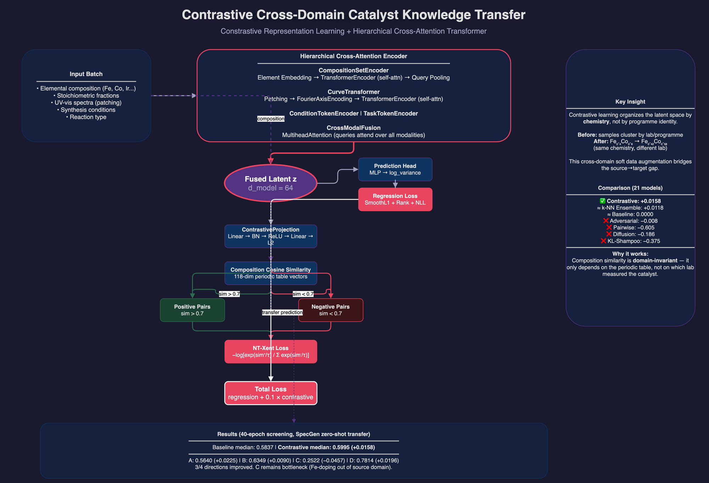

# Contrastive Cross-Domain Catalyst Knowledge Transfer

**Best-performing model among 21 variants tested** — +0.0158 median Spearman gain over baseline on SpecGen zero-shot transfer.

## Architecture



The model uses the **same hierarchical cross-attention Transformer** as the original repo. The only addition is a **contrastive NT-Xent loss** computed on the fused latent representation `z`, structured by composition similarity (118-dim periodic table vectors).

**Key idea:** composition similarity is domain-invariant — Fe₀.₄Co₀.₆ is chemically similar to Fe₀.₄₂Co₀.₅₈ regardless of which lab measured which. The contrastive loss pulls latents of compositionally similar catalysts together (positive pairs, cosine sim > 0.7) and pushes dissimilar ones apart (negative pairs). This creates a latent space organized by chemistry, not by programme identity.

During transfer, target-domain catalysts with similar composition to source catalysts land near source latents → the prediction head interpolates rather than extrapolates.

## Results

### SpecGen zero-shot transfer (40-epoch screening)

| Target | Baseline | Contrastive | Gain |
|---|---|---|---|
| A | 0.5415 | 0.5640 | **+0.0225** |
| B | 0.6259 | 0.6349 | **+0.0090** |
| C | 0.2979 | 0.2522 | −0.0457 |
| D | 0.7618 | 0.7814 | **+0.0196** |
| **Median** | **0.5837** | **0.5995** | **+0.0158** |

3/4 directions improved. SpecGen C (Fe-doped) remains the bottleneck — source data has no Fe-rich catalysts.

### vs Other Methods (all 40-epoch screening)

| Method | Median Transfer Spearman | vs Baseline |
|---|---|---|
| **Contrastive** | **0.5995** | **+0.0158** |
| k-NN + Ensemble | 0.5958 | +0.0118 |
| Adversarial+Contrastive | 0.5893 | +0.0056 |
| Delta-MHAR | 0.5881 | +0.0044 |
| Baseline (Standard v1) | 0.5837 | — |
| Adversarial | 0.5754 | −0.0083 |
| Adversarial+Target | 0.2731 | −0.3106 |
| Pairwise Encoder | −0.0212 | −0.6049 |

Full comparison of 21 models: [MODEL_COMPARISON.md](MODEL_COMPARISON.md).

## How It Works

### Training Loss

```
L_total = L_regression + 0.1 × L_contrastive

L_regression = SmoothL1(pred, target) + rank_weight × RankLoss + NLL_weight × NLL
L_contrastive = NT-Xent(proj(z), positive_pairs, temperature=0.1)
```

### Positive Pair Construction

1. Convert each catalyst's composition to a 118-dim periodic table vector
2. Compute pairwise cosine similarity within the batch
3. Pairs with similarity > 0.7 are positive (same chemistry → pull together)
4. Pairs with similarity < 0.7 are negative (different chemistry → push apart)

The contrastive loss is computed on a small projection head (SimCLR pattern), discarded after training. Only the encoder's latent space is used for transfer.

### Why It Beats Adversarial Adaptation

| | Contrastive | Adversarial (GRL) |
|---|---|---|
| Signal | Composition similarity (domain-invariant, clean) | Domain label (coupled with chemical info) |
| Effect | Organizes latent by chemistry | Hides domain identity |
| Risk | Only pulls similar compositions together (conservative) | Erases chemical differences along with domain identity |
| Result | +0.016 | −0.311 |

## Files

```
catalyst_attention/
├── model.py              # Hierarchical cross-attention Transformer
├── training.py           # Training loop with contrastive loss integration
├── contrastive.py        # NT-Xent loss, composition similarity, projection head
├── domain_adversarial.py # GRL + DomainClassifier (alternative, did not work)
├── latent_diffusion.py   # DDPM on latent space (experimental, did not work)
├── genetic_search.py     # GA architecture search (for future use)
├── meta_learning.py      # FOMAML (for future use)
├── expert_router.py      # 5-strategy routing between Standard and Delta-MHAR
├── optimizers.py         # KL-Shampoo wrapper (did not work)
├── baselines.py          # PLS, ExtraTrees, TabPFN baselines
├── data.py               # SpecGen, OCx24, SECCM data loaders
└── schema.py             # Categorical schema

analysis/
├── run_transfer_screening.py   # 40-epoch screening (all 8 methods)
├── run_full_benchmark.py       # 180-epoch full benchmark
├── run_round2_screening.py     # Delta-MHAR combo screening
├── run_diffusion_experiment.py # Diffusion augmentation experiment
├── run_latent_interpolation.py # k-NN latent interpolation
├── MODEL_COMPARISON.md         # Complete comparison of 21 models
└── contrastive_architecture.drawio  # Editable architecture diagram
```

## Usage

```bash
# 40-epoch quick screen
python analysis/run_transfer_screening.py --epochs 40 --skip-adaptation

# 180-epoch full benchmark with contrastive
python analysis/run_full_benchmark.py

# Run all tests
python -m pytest tests/test_catalyst_attention.py -v
```

## Key Insight

**Contrastive learning improves transfer because composition similarity is a clean, domain-invariant signal.** It adds a soft constraint on the latent space that is independent of which lab, programme, or measurement protocol produced each sample. This is fundamentally different from adversarial adaptation (which tries to erase domain information — but also erases chemistry) and from architectural changes (which add capacity without addressing the representation gap).

The bottleneck is not model architecture — it's **chemical coverage of the source domain.** SpecGen source has only Ir-based OER catalysts. SpecGen C adds Fe doping, which is chemically distinct and has no close neighbors in source composition space. No method (contrastive, adversarial, diffusion, interpolation) can bridge this gap without actual diverse source data.

## Citation

If you use this work, please cite the original SpecGen dataset:

> Wang, Y., et al. "SpecGen: A generative model for the autonomous design of multi-metal catalysts." *Nature Synthesis* (2025). DOI: [10.1038/s44160-025-00983-5](https://doi.org/10.1038/s44160-025-00983-5)

And the contrastive learning method:

> Chen, T., et al. "A Simple Framework for Contrastive Learning of Visual Representations." *ICML* (2020).
