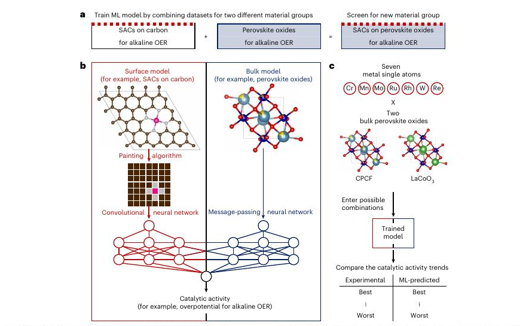
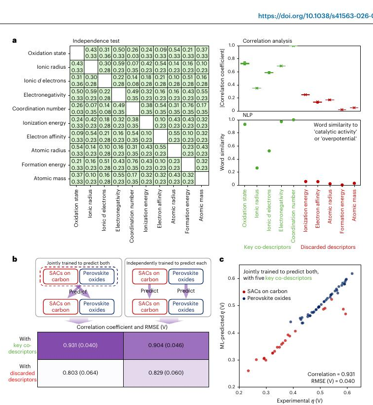

# Cross-material catalyst discovery via deep learning

> Reader status: method-focused bilingual draft. The full article and
> Supplementary Information were parsed locally; the blocks below cover every
> claim used to redesign the present project. They are not a substitute for
> the published paper.

## Metadata

- Authors: Junseok Moon, Seungwoo Yoo, Jaehyuk Shim, Sungeun Heo, Jeong Hyun
  Kim, Megalamane S. Bootharaju, Kug-Seung Lee, Jaeyune Ryu, Yung-Eun Sung and
  Taeghwan Hyeon
- Journal: *Nature Materials* (2026)
- DOI: <https://doi.org/10.1038/s41563-026-02622-6>
- Main training data: 22 single-atom catalysts on carbon and 41 bulk
  perovskite oxides, all for alkaline oxygen evolution
- Untrained target class: single-atom catalysts supported on perovskite oxides

## One-sentence result / 一句话结论

**Original.** The paper succeeds because the target material is an explicit
crossbreed of the two source material classes, allowing separate surface and
bulk knowledge modules to be joined through shared chemical co-descriptors.

**中文。** 这项工作之所以能够成功，不是因为“任意相邻数据库都能迁移”，而是因为目标材料本身就是两类源材料的结构组合，因此可以用共同化学描述符把表面知识分支和体相知识分支有针对性地拼接起来。

## Architecture / 模型架构

**Original.** The crossbreeding neural network contains a surface branch and a
bulk branch. The surface branch encodes atom-resolved two-dimensional images
with a convolutional neural network. The bulk branch encodes a 2×2×2
perovskite supercell as a graph with message passing and transformer readout.
During source training, only the branch relevant to each source material class
is active; both branches are activated and concatenated for the hybrid target.

**中文。** CBNN 包含表面分支和体相分支。表面分支把原子排列映射为二维图像并用卷积神经网络编码；体相分支把 2×2×2 钙钛矿超胞表示成图，并通过消息传递和 Transformer readout 编码。训练两类源材料时，仅激活与该源材料对应的分支；预测复合目标材料时，再同时激活并拼接两个分支。

## Shared co-descriptors / 共享描述符

**Original.** Five co-descriptors—oxidation state, ionic radius, valence
d-electron count, Pauling electronegativity and coordination number—were
selected by combining cross-validated outcome association with an external
literature NLP score. The same descriptors were used as image channels and
graph node features, creating a common chemical language across the two
branches.

**中文。** 作者把交叉验证中的性能关联与外部文献 NLP 得分结合，筛选出氧化态、离子半径、价层 d 电子数、Pauling 电负性和配位数五个共同描述符。这些描述符同时作为表面图像通道和体相图节点特征，从而为两类材料建立共同的化学语言。

The Supplementary Information reports that the descriptor ranking was repeated
inside leave-one-out folds and remained unchanged. Joint training with the five
selected descriptors gave a reported cross-validated correlation of 0.931 and
RMSE of 0.040 V, compared with 0.803 and 0.064 V for five discarded
descriptors.

补充信息称，描述符筛选在留一折内重复执行，五个入选描述符保持不变。使用这五个描述符联合训练时，作者报告的交叉验证相关系数为 0.931、RMSE 为 0.040 V；使用五个被舍弃的描述符时，相应数值为 0.803 和 0.064 V。

## Validation / 验证

**Original.** Model development used leave-one-out cross-validation over 63
source samples and five random graph seeds. The target validation comprised 14
monometallic single-atom catalysts on two perovskite supports. Because absolute
overpotentials can shift between experimental protocols, the main target
comparison emphasized relative activity ordering. The authors then screened
8,008 multimetallic compositions on one support and experimentally evaluated a
selected W–Mo–Ru–Rh candidate.

**中文。** 模型开发对 63 个源样本进行了留一交叉验证，并使用五个随机图结构种子。目标验证包括两种钙钛矿载体上的 14 个单金属单原子催化剂。由于不同实验流程会造成绝对过电位偏移，目标验证主要比较相对活性排序。随后，作者在一种载体上筛选 8,008 个多金属组合，并实验验证了选出的 W–Mo–Ru–Rh 候选。

The selected catalyst reached an intrinsic overpotential of 349 mV at
10 mA cm−2 of oxide and was reported stable for 120 h at
100 mA cm−2 of disk current density. These experiments validate a useful
candidate and ranking trend, but they do not estimate a population-level OOD
prediction effect over independent target programmes.

所选催化剂在 10 mA cm−2（以氧化物计）时的本征过电位为 349 mV，并在 100 mA cm−2（以电极面积计）下稳定运行 120 h。该结果验证了候选材料和排序趋势，但不能据此估计跨独立目标项目的总体 OOD 预测效应。

## What transfers to the present project / 对本项目的直接启发

**Original.** The transferable lesson is architectural: identify the physical
factor or material component supplied by each source, encode it in a separate
module, connect modules with shared co-descriptors, and use the prediction head
appropriate to the calibration that can actually be transported. This is
stronger than appending one donor prediction to every recipient, while also
being narrower and more falsifiable than generic “cross-domain transfer.”

**中文。** 真正可迁移的经验是架构原则：先确定每个源领域提供的是哪个物理因子或材料组件，再用独立模块编码，以共享描述符连接各模块，并根据能够跨数据库保持的标定关系选择预测头。它比对所有 recipient 统一追加一个 donor 预测值更有信息量，也比笼统宣称“跨领域迁移”更窄、更容易证伪。

## Adversarial limitations / 对该论文的审慎审计

1. **Small and structurally favorable training problem.** The two source
   datasets contain only 63 samples, and the target is deliberately assembled
   from the source material components under the same reaction family.
2. **Rank rather than absolute extrapolation.** Much of the target and external
   validation uses normalized ranks or local rank correlations because
   absolute scales differ.
3. **Overlapping local neighborhoods.** Counts of high-correlation local
   regions in the external analysis are not counts of independent tests.
4. **Outcome thresholds from resampling are not external replication.** Monte
   Carlo subsampling of the same 63-point corpus cannot replace a new target
   programme.
5. **One selected multimetallic candidate.** The experimental hit is valuable,
   but it does not identify the prospective success rate of the screening
   policy.

中文对应：

1. 两个源数据集总计只有 63 个样本，而且目标材料在结构上恰好由源材料组件组合而成，属于对迁移非常有利的问题。
2. 由于绝对标尺不一致，许多目标与外部验证采用归一化排序或局部秩相关，而不是绝对数值外推。
3. 外部验证中大量“高相关局部区域”彼此可能重叠，不能当作独立重复。
4. 在同一 63 点数据上进行 Monte Carlo 子采样，不能替代新的目标项目验证。
5. 实验命中一个多金属候选很有价值，但不能给出筛选策略的前瞻成功率。

